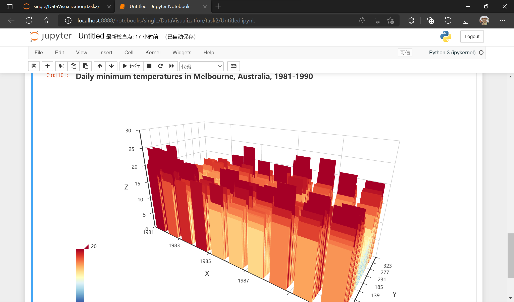

# 实验2 统计图可视化

#### 1. 实验任务

对*daily-minimum-temperatures-in-me.csv*中的数据进行处理

#### 2. 实验思路

1. 使用python平台
2. 使用pandas进行数据读取
3. 使用datetime进行数据处理。其中由于每一年的天数并不相同，统一用该年的第几天代替具体的日期
4. 使用pyecharts的Bar3D模块进行可视化

#### 3. 实验结果



#### 4. 代码

1. 读取*daily-minimum-temperatures-in-me.csv*

    ``` python
    import pandas as pd
    df = pd.read_csv('daily-minimum-temper.csv')
    df
    ```

2. 处理数据

    ``` python
    import datetime
    
    # 获取[x,y]值 x轴为年 y轴为日期对应该年的第几天
    def xy(datestr):
        yy = int(datestr.split('-')[0])
        mm = int(datestr.split('-')[1])
        dd = int(datestr.split('-')[2])
        b = datetime.date(yy,1,1)
        d = datetime.date(yy,mm,dd)
        x = d.year - 1981
        y = (d - b).days
        return [x,y]
    
    # 获取z值 z轴为温度
    def z(datastr):
        if '?' in datastr:
            # 处理坏值
            datastr = datastr[1:]
        return float(datastr)
    
    x_axis = [str(i) for i in range(1981,1991)]
    # print(x_axis)
    y_axis = [str(i) for i in range(1,367)]
    # print(y_axis)
    data = []
    for i in df.index:
        subdata = xy(df.iloc[i,0])
        subdata.append(z(df.iloc[i,1]))
        data.append(subdata)
    # print(data)
    ```

3. 可视化

    ```python
    from pyecharts.charts import Bar3D
    import pyecharts.options as opts
    
    res = (
        Bar3D(init_opts=opts.InitOpts(width="900px", height="600px")).add(
            series_name="",
            data=data,
            xaxis3d_opts=opts.Axis3DOpts(type_="category", data=x_axis),
            yaxis3d_opts=opts.Axis3DOpts(type_="category", data=y_axis),
            zaxis3d_opts=opts.Axis3DOpts(type_="value"),
        ).set_global_opts(
            title_opts=opts.TitleOpts("Daily minimum temperatures in Melbourne, Australia, 1981-1990"),
            visualmap_opts=opts.VisualMapOpts(
                max_=20,
                range_color=[
                    "#313695", "#4575b4", "#74add1", "#abd9e9", "#e0f3f8", "#ffffbf", "#fee090", "#fdae61", "#f46d43",
                    "#d73027", "#a50026",
                ],
            )
        )
    )
    res.render_notebook()
    ```

    