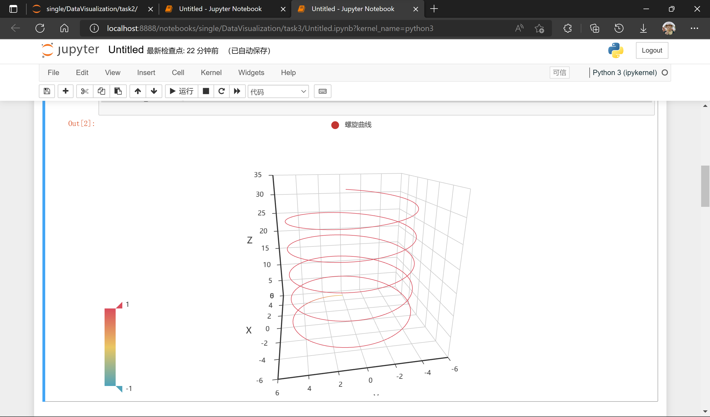
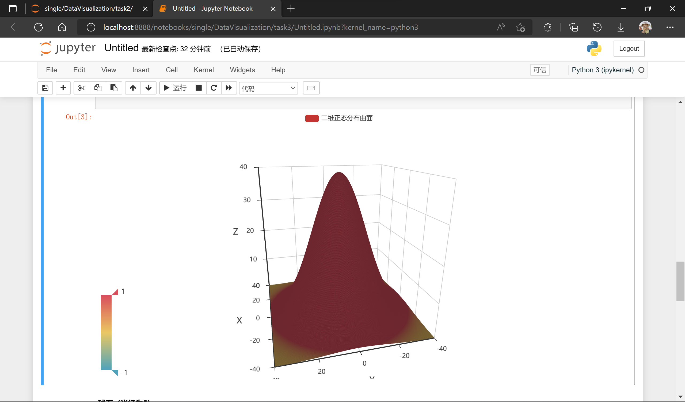
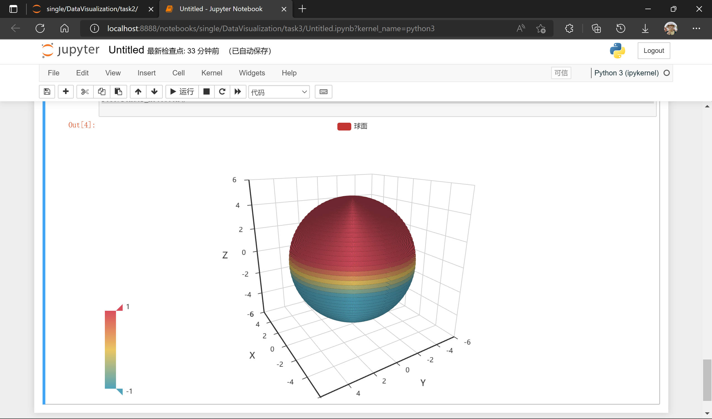

# 实验3 空间数据数据可视化

### 一、实验内容

在3D空间中绘制以下图形：

1. 螺旋曲线（半径为5，每旋转一周z坐标增加π）
2. 二元正态分布曲面
3. 球面（半径为5）

### 二、解决思路：

1. 导包

    ``` python
    import numpy as np
    import pyecharts.options as opts
    from pyecharts.charts import Line3D
    from pyecharts.charts import Surface3D
    ```

2. **螺线曲线**
    1. 螺旋曲线的方程：
        $$
        x=r\cos{k\omega{t}} \\
        y=r\sin{k\omega{t}} \\
        z=k\omega{t}
        $$
        此处半径$r=5$，$\Delta{z}=k\omega{T}=2\pi{k}=\pi \Rightarrow k=0.5$

    2. 代码实现

        ``` python
        spiral_list = []
        for wt in np.arange(0, 20*np.pi, np.pi/20):
            x = 5*np.cos(0.5*wt)
            y = 5*np.sin(0.5*wt)
            z = 0.5*wt
            spiral_list.append([x, y, z])
        
        res1 = (
            Line3D()
            .add(
                series_name="螺旋曲线",
                data=spiral_list,
                xaxis3d_opts=opts.Axis3DOpts(type_="value"),
                yaxis3d_opts=opts.Axis3DOpts(type_="value"),
                zaxis3d_opts=opts.Axis3DOpts(type_="value"),
                shading="color",
                grid3d_opts=opts.Grid3DOpts(
                    width=100,
                    height=100,
                    depth=100,
                    is_rotate=True,
                    rotate_speed=10,
                    rotate_sensitivity=1,
                )
            )
            .set_global_opts(
                visualmap_opts=opts.VisualMapOpts(
                    min_=-1,
                    max_=1
                )
            )
        )
        
        res1.render_notebook()
        
        ```

    3. 效果图

        


3. **二元正态分布曲面**

    1. 二元正态分布曲面的方程
        $$
        f(x,y)=\frac{1}{2\pi\sigma_1\sigma_2}\exp{[-\frac{1}{2}(\frac{(x-\mu_1)^2}{\sigma_1^2}+\frac{(y-\mu_2)^2}{\sigma_2^2})]}
        $$
        

    2. 代码实现

        ``` python
        # 二维正态分布参数
        sigma_1 = 15
        sigma_2 = 15
        u_1 = 0
        u_2 = 0
        A = 40
        
        data = []
        for i in np.arange(-40, 40, 0.1):
            for j in np.arange(-40, 40, 0.1):
                x = i
                y = j
                z = A * pow(np.e, -(pow(x - u_1, 2) / pow(sigma_1, 2) + pow(y - u_2, 2) / pow(sigma_2, 2)) / 2.0)
                data.append([x, y, z])
        data = list([[elem[1], elem[0], elem[2]] for elem in data])
        
        res2 = (
            Surface3D()
            .add(
                series_name="二维正态分布曲面",
                data=data,
                xaxis3d_opts=opts.Axis3DOpts(
                    type_="value",
                ),
                yaxis3d_opts=opts.Axis3DOpts(
                    type_="value",
                ),
                zaxis3d_opts=opts.Axis3DOpts(
                    type_="value",
                ),
                shading="color",
                grid3d_opts=opts.Grid3DOpts(
                    width=100,
                    height=100,
                    depth=100,
                    is_rotate=True,
                    rotate_speed=10,
                    rotate_sensitivity=1,
                ),
            )
            .set_global_opts(
                visualmap_opts=opts.VisualMapOpts(
                    type_="color",
                    min_=-1,
                    max_=1,
                )
            )
        )
        
        res2.render_notebook()
        
        ```

    3. 效果图

        

4. **球面**

    1. 球面方程
        $$
        \begin{cases}
        x=R\sin\phi\cos\theta \\
        y=R\sin\phi\sin\theta \\
        z=R\cos\phi
        \end{cases}
        $$
        其中$R$为球面半径，$0\le\theta\le2\pi$，$0\lt\phi\le\pi$

    2. 代码实现

        ``` python
        ball_list = []
        # 球坐标
        for fai in np.arange(0, np.pi, np.pi / 50):
            for seita in np.arange(0, 2 * np.pi, np.pi / 200):
                x = 5 * np.sin(fai) * np.cos(seita)
                y = 5 * np.sin(fai) * np.sin(seita)
                z = 5 * np.cos(fai)
                ball_list.append([x, y, z])
        
        res3 = (
            Surface3D()
            .add(
                series_name="球面",
                shading="color",
                data=ball_list,
                xaxis3d_opts=opts.Axis3DOpts(type_="value"),
                yaxis3d_opts=opts.Axis3DOpts(type_="value"),
                grid3d_opts=opts.Grid3DOpts(
                    width=100,
                    height=100,
                    depth=100,
                    is_rotate=True,
                    rotate_speed=10,
                    rotate_sensitivity=1,
                ),
            )
            .set_global_opts(
                visualmap_opts=opts.VisualMapOpts(
                    min_=-1,
                    max_=1,
                )
            )
        )
        
        res3.render_notebook()
        
        ```

    3. 效果图

        