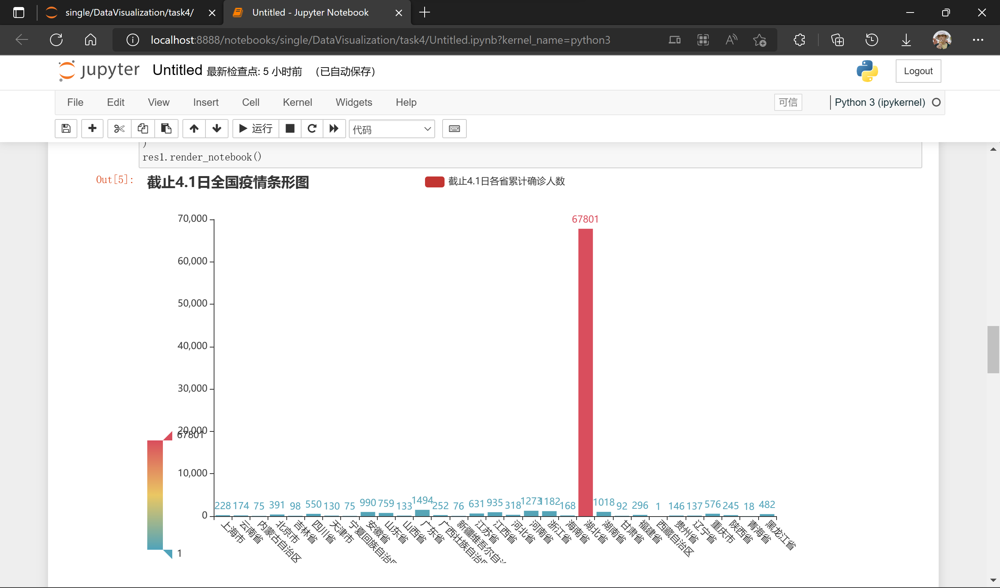
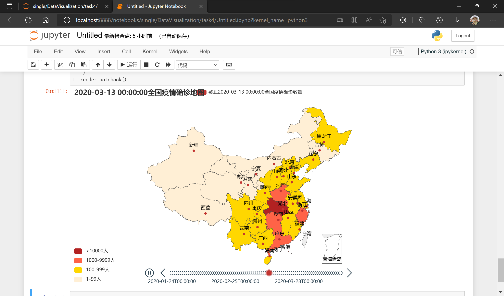

# 实验4 地理数据可视化

### 一、实验内容

利用已有数据*CityData.xlsx*与已有工具，设计可视化方案，展示2020年全国新冠患者人数随时间的变化过程，并完成以下任务：

- 任务一：统计截止4月1日各省的累计确诊数量，并通过图表展示。

- 任务二：对每日各省的累计确诊患者数量进行统计，为图像添加时间轴，通过时间轴自动播放演示疫情发展的整个过程。

### 二、实验思路

1. 导包

    ``` python
    import pandas as pd
    from pyecharts import options as opts
    from pyecharts.charts import Map, Bar, Timeline
    
    ```

2. 读取文件

    使用pandas读取文件并进行预处理，去除不需要的数据，并对各省每日的确诊人数汇总列出

    代码如下

    ``` python
    df = pd.read_excel('CityData.xlsx')  # 原始数据
    group_df = df.groupby(['provinceName', 'updateTime'])['city_confirmedCount'].sum()
    df = pd.DataFrame(group_df).reset_index()  # 预处理结果
    df
    
    ```

    结果为

3. 对于任务一，关键在于取出各省至2020年4月1日的确诊人数，该数据不便于从表中直接获得。考虑用`DataFrame.groupby()`方法处理表格，得出各省至4月1日前最后一次记录的数据

    整理数据

    ``` python
    provinces = list(set(df['provinceName'].to_list()))
    provinces.sort()
    
    data_0401 = {province: 0 for province in provinces}
    
    grouped = df.loc[df['updateTime'] < pd.Timestamp('2020-04-01 00:00:00'),:].groupby(['provinceName'])
    for province, sub_df in grouped:
        print(province)
        print(sub_df)
        data_0401[province] = int(sub_df.iloc[-1, 2])
    
    data_0401 = list(data_0401.values())
    
    ```

    可视化
    
    ``` python
    res = (
        Bar()
        .add_xaxis(
            xaxis_data=provinces
        )
        .add_yaxis(
            series_name="截止4.1日各省累计确诊人数",
            y_axis=data_0401
        )
        .set_global_opts(
            title_opts=opts.TitleOpts(
                title="截止4.1日全国疫情条形图"
            ),
            xaxis_opts=opts.AxisOpts(
                axislabel_opts=opts.LabelOpts(rotate=-45)
            ),
            visualmap_opts=opts.VisualMapOpts(
                min_=min(data_0401),
                max_=max(data_0401)
            )
        )
    )
    res.render_notebook()
    
    ```
    
4. 对于任务二，可采用相同的方法取得每天各省确诊人数

    获取每天各省确诊人数数据代码如下

    ``` python
    data = {province: 0 for province in provinces}  # 持续记录每天各省确诊人数
    grouped = df.groupby(['updateTime'])
    
    
    def get_data(day):
        # day: pd.Timestamp
        sub_df = grouped.get_group(day)
        for _, row in sub_df.iterrows():
            data[row['provinceName']] = int(row['city_confirmedCount'])
        # Map() 中 data_pair 接收的参数必须删除后缀 省/市/自治区/壮族/回族/维吾尔
        my_data = [[key.strip("省").strip("市").strip("自治区").strip("壮族").strip("回族").strip("维吾尔"), value] for key, value in data.items()]
        return my_data
    
    ```

    可视化

    ``` python
    date = list(set(list(df['updateTime'])))
    date.sort()
    t1 = Timeline()
    
    for day in date:
        my_map = (
            Map()
            .add(
                series_name="截止{}全国疫情确诊数量".format(day),
                data_pair=get_data(day)
            )
            .set_global_opts(
                title_opts=opts.TitleOpts(
                    title="{}全国疫情确诊地图".format(day),
                ),
                visualmap_opts=opts.VisualMapOpts(
                    is_piecewise=True, # 是否为分段型
                    pieces=[
                        {"min": 1, "max": 99, "label": "1-99人", "color": "#FFEFD5"},
                        {"min": 100, "max": 999, "label": "100-999人", "color": "#FFD700"},
                        {"min": 1000, "max": 9999, "label": "1000-9999人", "color": "#FF6347"},
                        {"min": 10000, "max": 999999, "label": ">10000人", "color": "#B22222"},
                    ]
                )
            )
        )
        t1.add(my_map, day)
        t1.add_schema(
            is_auto_play=True,  # 是否自动播放
            is_loop_play=True,  # 是否循环播放
            play_interval=1000  # 间隔
        )
    t1.render_notebook()
    
    ```

### 三、实验结果

1. 任务一

    

2. 任务二

    