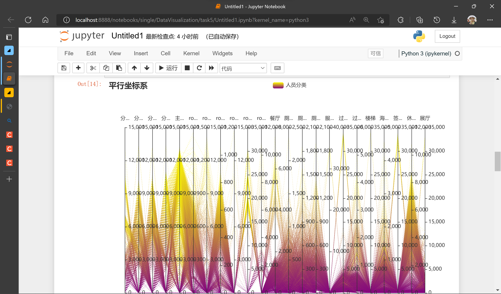
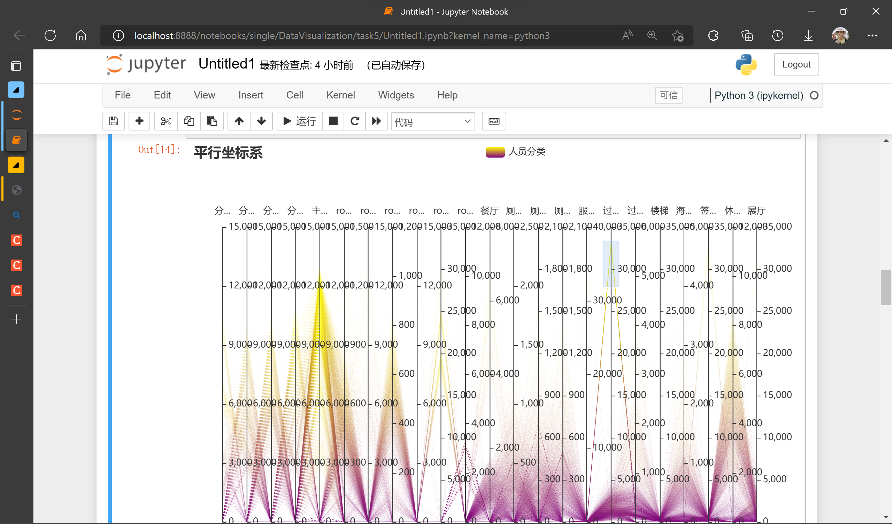
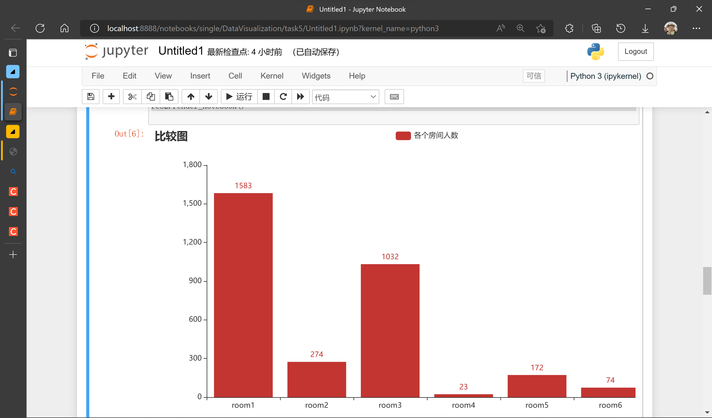
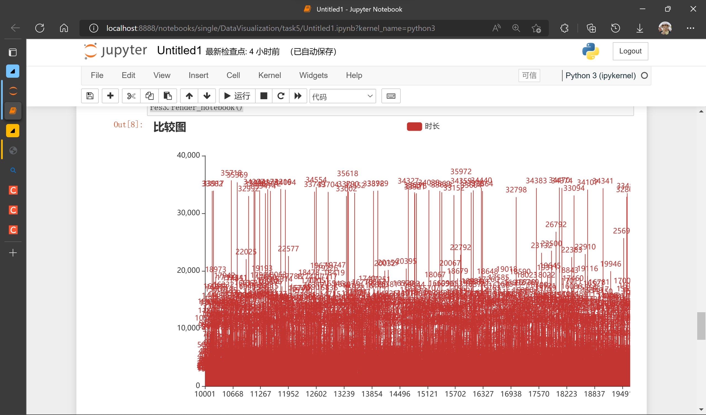
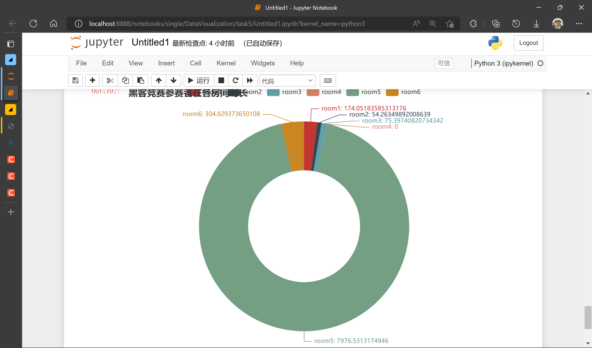

# 实验5 高维非空间数据可视化

**一、实验内容**

在某次大型会议中，为确保会议过程安全，会场使用了电子胸牌对场内人员的移动轨迹进行了监控。现经过处理，得到了某一天内人员在场内各个区域逗留的时间统计数据（time_allocate_day1.csv，课程资料库下载）。请根据这份数据，完成以下任务：

1. 设计可视化方案，通过该方案可以实现对人员的分类（绘制出图像即可）
2. 请分析会场中room1~6的功能。

**二、代码实现**

1. 导包，并读入数据

    ``` python
    import pandas as pd
    from pyecharts import options as opts
    from pyecharts.charts import Parallel, Pie, Bar
    
    df = pd.read_excel("time_allocate_day1.xlsx", index_col=0)
    df
    ```

2. 画平行坐标系，实现对人员的分类

    ``` python
    # 获取绘制平行坐标系的数据
    
    parallel_axis = []
    for index, column in enumerate(df):
        parallel_axis.append({"dim": index, "name": column})
    
    data = []
    for _, elem in df.iterrows():
        temp = []
        for i in range(23):
            temp.append(int(elem[i]))
        data.append(temp)
    
    res1 = (
        Parallel(init_opts=opts.InitOpts(width="850px", height="550px"))
        .add_schema(schema=parallel_axis)
        .add(
            series_name="人员分类",
            data=data,
            linestyle_opts=opts.LineStyleOpts(
                # 线宽
                width=0.5,
                # 透明度
                opacity=0.5,
                # 线的类型 solid/dashed/dotted
                type_="dashed",
                # 线的颜色
                # 线性渐变，前四个参数分别是 x0, y0, x2, y2, 范围从 0 - 1，相当于在图形包围盒中的百分比
                # 如果 globalCoord 为 `true`，则该四个值是绝对的像素位置
                color={
                   'type': 'linear',
                   'x': 0,
                   'y': 0,
                   'x2': 0,
                   'y2': 1,
                   'colorStops': [{'offset': 0, 'color': 'yellow'}, {'offset': 1, 'color': "purple"}],
                   "global": False
                }
            )
        )
        .set_global_opts(
            title_opts=opts.TitleOpts(
                title="平行坐标系"
            )
        )
    )
    res1.render_notebook()
    ```

3. 分析会场中room1~6的功能

    1. 由嘉宾与记者人数来找出嘉宾休息区、记者区

        ``` python
        x = ['room1', 'room2', 'room3', 'room4', 'room5', 'room6']
        y = [len(df[df[r]!=0]) for r in x]
        
        res2 = Bar()
        res2.add_xaxis(x)
        res2.add_yaxis('各个房间人数', y)
        res2.set_global_opts(title_opts=opts.TitleOpts(title='比较图'))
        
        res2.render_notebook()
        
        ```

    2. 根据工作人员有固定岗位安排的特点找出工作人员

        ``` python
        tmp = df[['餐厅','服务台','过道1楼','过道2楼','楼梯','海报区','签到处','休闲区','展厅']].sum(axis=1)
        
        res3 = Bar()
        res3.add_xaxis(list(tmp.index))
        res3.add_yaxis('时长', [int(i) for i in tmp.values])
        res3.set_global_opts(title_opts=opts.TitleOpts(title='比较图'))
        res3.render_notebook()
        ```

    3. 跟据黑客竞赛参赛者未参与主会场与分会场的信息获得黑客竞赛现场等信息

        ``` python
        sub_df = df.loc[(df['分会场A']==0) & (df['分会场B']==0) & (df['分会场C']==0) & (df['分会场D']==0) & (df['主会场']==0),['room1','room2','room3','room4','room5','room6']]
        
        attr = list(sub_df.mean().index)
        v1 = list(sub_df.mean().values)
        
        res4 = (
            Pie(init_opts=opts.InitOpts(width="700px", height="550px"))
            .add(
                    "",
                    [list(z) for z in zip(attr,v1)],
                    radius=["40%", "75%"],
                )
            .set_global_opts(title_opts=opts.TitleOpts(title="黑客竞赛参赛者在各房间时长"))
            .set_series_opts(label_opts=opts.LabelOpts(formatter="{b}: {c}"))
        )
        res4.render_notebook()
        ```

**三、实验结果**

1. 任务一结果

    

    以“过道1楼”数据为例，人员可以被大致分为3类。选中最上面的一类可以看到该类人员在其他场所的分布情况

    

2. 任务二结果

    

    图中数据为去过各个房间的总人数。其中room2与嘉宾人数相近，可以认为是嘉宾休息区；同理，room4可以认为是记者区。

    

    图中数据为所有人在除了主会场、分会场、room、厕所以外地区的停留时间。可以认为停留时间大于30000的为场内工作人员。

    

    图中数据为黑客竞赛参赛者平均在各个房间的时长。如果认为参赛者会花费大量时间停留在竞赛场地，其余时间均在休息区休息，那么可以认为room5是黑客竞赛现场，room6和room1是休息区。

    综上，剩下的room3为工作人员休息区。