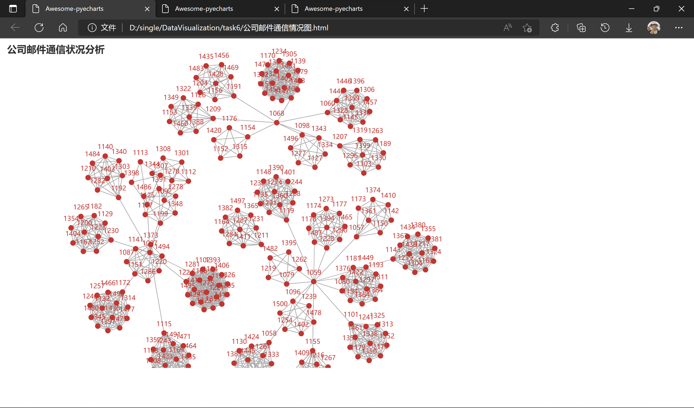
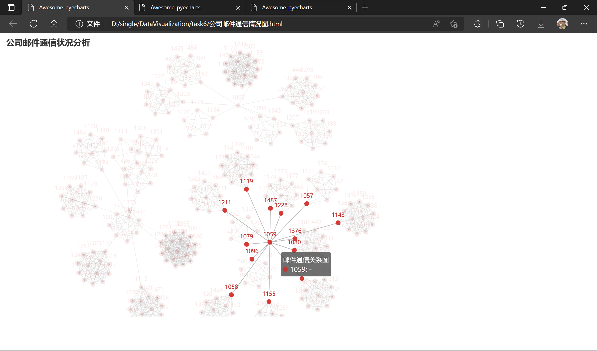
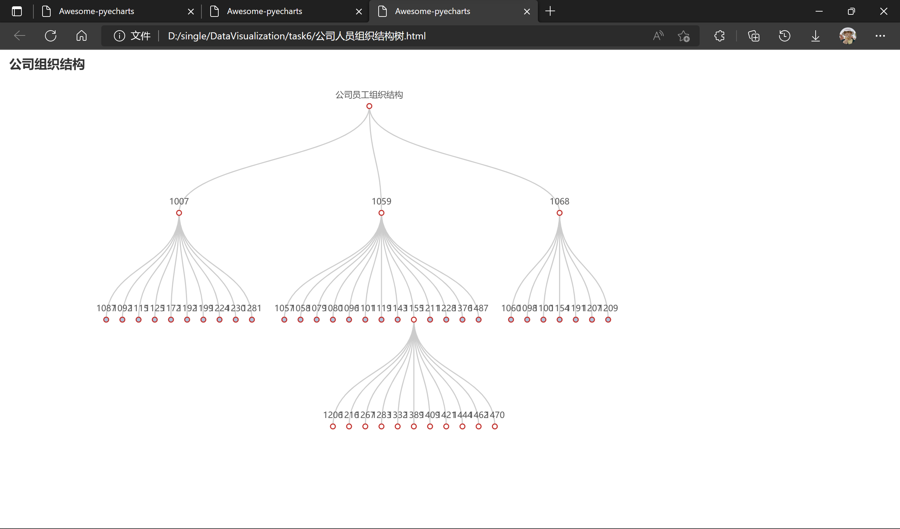
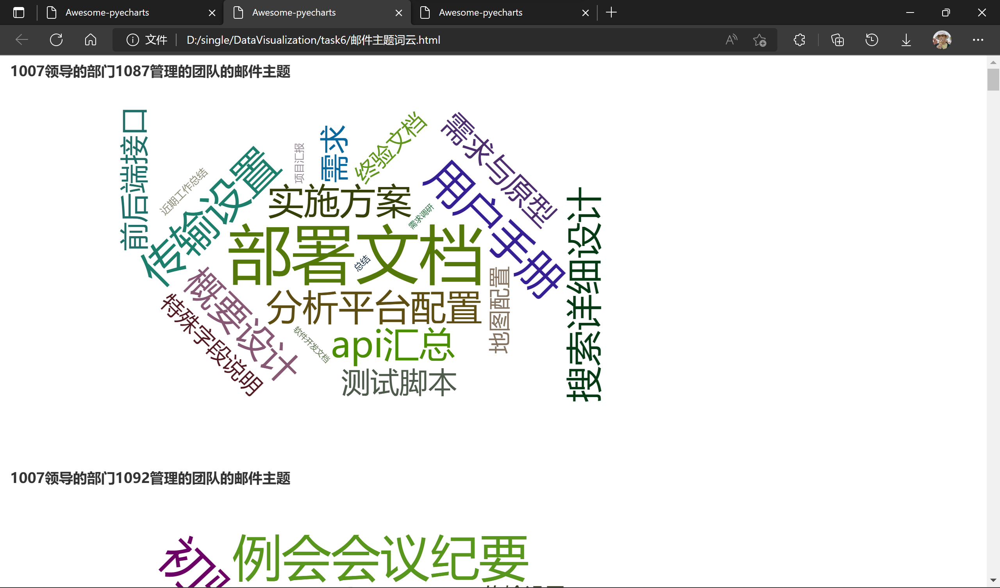

# 实验6 层次和网络可视化、文本可视化

### 一、实验内容

现有xx公司一个月内研发部门成员间的邮件往来记录（email_dev_inside.xlsx，课程资料库下载），请根据以下要求完成对该公司的研发部门的可视化分析：

1. 对邮件往来数据进行处理，选择合适的图表，展示公司研发部门的成员组织结构，分别找出每个群体的负责人。
2. 对邮件内容数据进行处理，分析研发部门以及每个群体中的主要工作内容。

### 二、代码实现

``` python
import pandas as pd
from pyecharts import options as opts
from pyecharts.charts import Graph, Tree, Page, WordCloud


Link = []   # 全局变量 两个结点之间关系 即邮件通信
infos = []  # 发件人-收件人-主题


# ------------- 绘制关系图-------------------
# 获取绘制关系图的数据
def get_data_for_graph(f):
    global Link
    # 记录所有的结点 即公司的所有员工 员工用邮件的前四位表示
    Node = []
    # 遍历文件的每一行
    for _, elem in f.iterrows():
        # 添加结点
        Node.append(elem[6][0:4])  # 发件人
        Node.append(elem[7][0:4])  # 收件人
        infos.append([elem[6][0:4], elem[7][0:4], elem[8]])
        # 建立节点之间的关系
        Link.append({"source": elem[6][0:4], "target": elem[7][0:4]})
    # 对Node进行去重
    Node = set(Node)
    my_Node = [{"name": node, "symbolsize": 1} for node in Node]
    return my_Node, Link


def draw_graph(f):
    node, link = get_data_for_graph(f)
    (
        Graph(opts.InitOpts(width="1000px", height="600px"))
        .add("邮件通信关系图", node, link)
        .set_global_opts(title_opts=opts.TitleOpts(title="公司邮件通信状况分析"))
        .render("公司邮件通信情况图.html")
    )


# ----------------绘制公司人员结构Tree---------------------------------------
# draw_graph后可以看出分为三个部门
three_leader = ["1007", "1059", "1068"]


# 找到每个leader的下属-项目经理
def find_manager_for_leader(leaders):
    # {"leader1":[mgr1,mgr2,……],"leader2”:[mgr1,mgr2,……],"leader3":[mgr1,mgr2,……]}
    relation = {}
    for leader in leaders:
        relation[leader] = []
    # Graph中与Leader相连的是他的下属managers
    # 遍历Link找与Leader相连的非leader结点即就是mgrs
    for link in Link:
        if link['source'] in leaders and link["target"] not in leaders:
            relation[link["source"]].append(link["target"])
        if link['source'] not in leaders and link["target"] in leaders:
            relation[link["target"]].append(link["source"])
    # 对leadr的下属mgrs去重
    for leader in leaders:
        relation[leader] = list(set(relation[leader]))
        relation[leader].sort()
    return relation


# 建立公司的人员结构字典
def creat_person_structure():
    the_person_struct = {}
    # {"leader1":{mgr1:[e1,e2,……],mgr2:[],……}],"leader2:{mgr1:[],mgr2:[],……},"leader3":{mgr1:[],mgr2:[],……}}
    for leader in three_leader:
        the_person_struct[leader] = {}
    relation_1 = find_manager_for_leader(three_leader)
    for leader, mgrs in relation_1.items():
        # 找mgrs的下属employee 与找leader的下属mgrs原理相同
        employee = find_manager_for_leader(mgrs)
        # 建立公司人员结构
        for mgr in mgrs:
            employee[mgr] = [item for item in employee[mgr]
                             if item not in three_leader]
            the_person_struct[leader][mgr] = employee[mgr]
    return the_person_struct


# 获取绘制Tree的数据
def get_data_for_tree():
    data_for_tree = [{"name": "公司员工组织结构", "children": []}]
    # 根据公司的人员结构构建Tree的data
    the_person_struct = creat_person_structure()
    i = 0  # leader的index
    for leader, mgrs in the_person_struct.items():
        data_for_tree[0]["children"].append({"name": leader, "children": []})
        # [{"name": "员工结构", "children": [{"name":leader1, "children":[]}]}]}]
        # [{"name": "员工结构", "children": [{"name":leader1, "children":[{"name":mgr1,children:[{"name":e1}]}]}]}]
        j = 0  # manager的index
        for mgr, employees in mgrs.items():
            data_for_tree[0]["children"][i]["children"].append(
                {"name": mgr, "children": []})
            for employee in employees:
                data_for_tree[0]["children"][i]["children"][j]["children"].append({
                                                                                  "name": employee})
            j += 1
        i += 1
    return data_for_tree


def draw_tree():
    (
        Tree(opts.InitOpts(width="1000px", height="600px"))
        .add(
            series_name="公司员工组织结构",
            data=get_data_for_tree(),
            orient="TB",  # 上下结构
            collapse_interval=0  # 折叠节点间隔，当节点过多时可以解决节点显示过杂间隔
        )
        .set_global_opts(title_opts=opts.TitleOpts(title="公司组织结构"))
        .render("公司人员组织结构树.html")
    )


# -------------------绘制邮件主题词云-------------------------------------
# 获取绘制词云的数据 以下边这种形式保存
# {"leader1":{mgr1:word_list,mgr2:[],……},"leader2:{mgr1:[],mgr2:[],……},"leader3":{mgr1:[],mgr2:[],……}}
def get_data_for_cloud():
    struct = creat_person_structure()
    # {"leader1":{mgr1:[],mgr2:[],……},"leader2:{mgr1:[],mgr2:[],……},"leader3":{mgr1:[],mgr2:[],……}}
    for leader, mgrs in struct.items():
        for mgr, employees in mgrs.items():
            # 创建一个字典：key是邮件的subject，value是出现的频率
            my_dict = {}
            # 遍历所有的邮件 查找leader-mgr下的员工的邮件主题
            for info in infos:
                if info[0] in employees or info[1] in employees:
                    # 如果字典中没有这个subject，添加一个key为suject,value为1的键值对
                    if info[2] not in list(my_dict.keys()):
                        my_dict[info[2]] = 1
                    # 如果字典中有这个subject，则value+1
                    else:
                        my_dict[info[2]] += 1
            # 词云数据
            word_list = [(subject, str(counts))
                         for subject, counts in my_dict.items()]
            # {"leader1":{mgr1:word_list,mgr2:[],……},"leader2:{mgr1:[],mgr2:[],……},"leader3":{mgr1:[],mgr2:[],……}}
            struct[leader][mgr] = word_list
    return struct


# 绘制wordcloud
def draw_cloud():
    # 组合图标 Page 顺序多图
    page = Page()
    # 获取绘制词云的数据
    data = get_data_for_cloud()
    # leader下的mgr负责这个小群体的邮件主题词云
    for leader, mgrs in data.items():
        for mgr, word_list in mgrs.items():
            word_cloud = (
                WordCloud()
                .add(
                    series_name=leader+"领导的部门"+mgr+"管理的团队的邮件主题",
                    data_pair=data[leader][mgr],
                    word_size_range=[10, 100]
                )
                .set_global_opts(
                    title_opts=opts.TitleOpts(
                        title=leader+"领导的部门"+mgr+"管理的团队的邮件主题"
                    )
                )
            )
            page.add(word_cloud)
    page.render("邮件主题词云.html")


if __name__ == '__main__':
    # 读取文件
    filename = "email_dev_inside.xlsx"
    df = pd.read_excel(filename)
    # 绘制公司员工关系图 Graph
    draw_graph(df)
    # 绘制公司员工关系结构 Tree
    draw_tree()
    # 绘制某部门某群体的邮件主题词云
    draw_cloud()

```

### 实验结果

1. 邮件通信图

    

    其中部门负责人位于各个点集的中心

    

2. 人员结构树

    

    节点未完全展开

3. 邮件内容词云

    

    图片值截取了部分