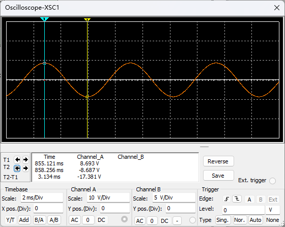
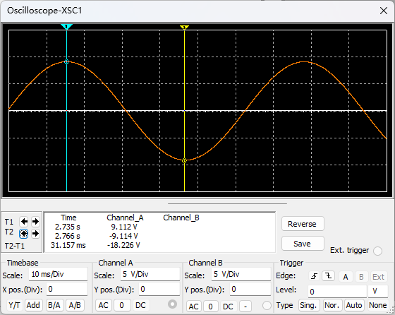

# 2022-10-29

#### 文氏桥振荡器

1. 电路设计
   
   
   
   
   
   信号幅度：8.691 V
   
   信号频率：0.160 kHz

2. RC
   
   R = 100koum，C = 100nF
   
   
   
   R = 1 koum，C = 100nF
   
   
   
   R = 10koum，C = 1000nF
   
   
   
   R = 10koum，C = 10nF
   
   

#### 正交振荡器

1. 电路设计
   
   
   
   
   
   A波形，信号幅度 0.93 mV，信号频率 1.881kHz
   
   B波形，信号幅度 527.992 mV，信号频率 1.848kHz
   
   相位差 93.892度

2. C
   
   C = 1 uF
   
   
   
   C = 0.01 uF
   
   
