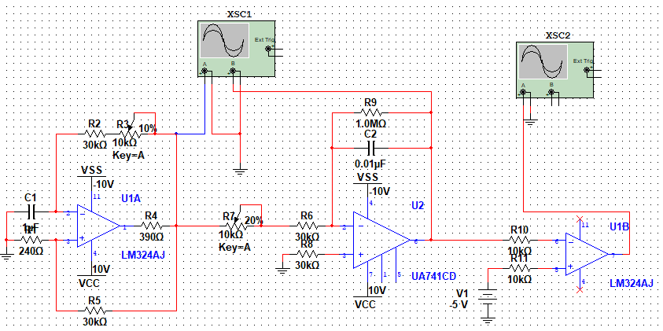
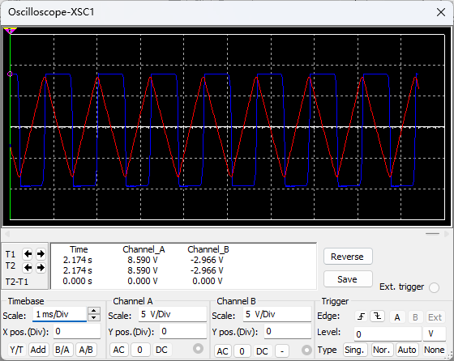
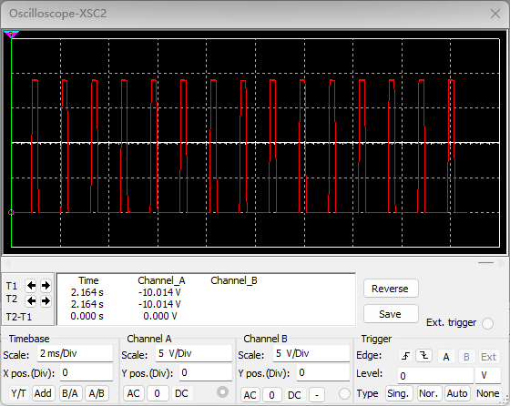

# 2022-10-30

1. 电路图

    

2. 波形图

    - V~1~ (蓝)，V~2~ (红)

    

    - V~3~

    

3. 改变V~5~ 值

    | V~m~ / V    | -5      | -3      | -1      | 0       | 1       | 3       | 5       |
    | ----------- | ------- | ------- | ------- | ------- | ------- | ------- | ------- |
    | $\tau$ / us | 197.761 | 339.552 | 477.612 | 552.239 | 611.940 | 764.925 | 906.716 |

    