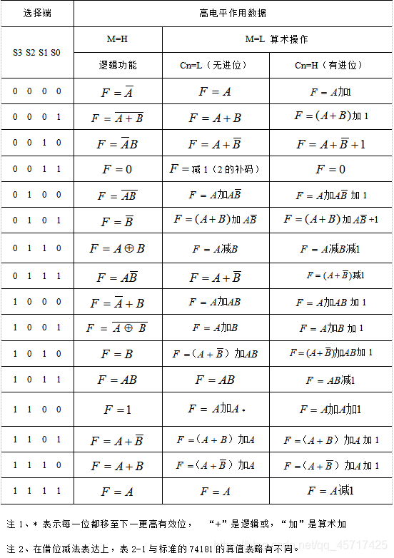
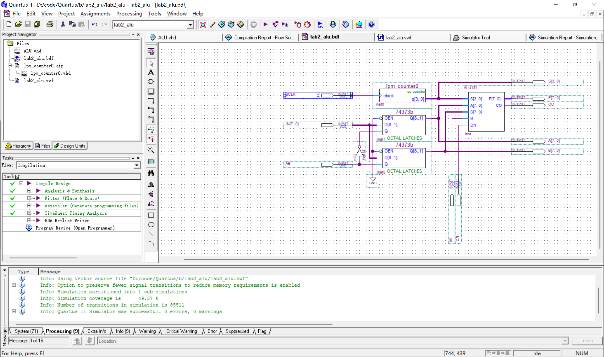
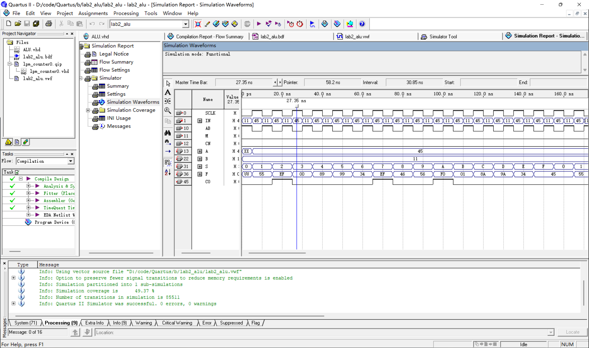

## 1. 实验目的

1. 了解简单运算器的数据传输通路
2. 验证运算功能发生器的组合功能
3. 掌握算术逻辑运算加、减、与的工作原理
4. 验证实验台运算的 8 位加、减、与、直通功能
5. 按给定数据，完成几种指定的算术和逻辑运算

## 2. 实验所用仪器

Quartus II 9.0

## 3. 实验基本原理及步骤

- 实验原理

  算术逻辑单元 ALU181 的功能表如下所示

  
  
- 实验步骤

  1. 用 VHDL 文件设计一个ALU元件
  1. 以原理图方式建立工程
  1. 通过 lpm_counter 元件产生 16 种操作码，进行波形仿真

## 4. 实验数据记录

1. 原理图设计

   

2. 波形仿真结果

   

3. 结果验证

   | 操作s | Quartus仿真结果 | Python计算结果 | 结果检查 |
   | :---: | :-------------: | :------------: | :------: |
   |   0   |       45        |       45       |   True   |
   |   1   |       55        |       55       |   True   |
   |   2   |       EF        |       EF       |   True   |
   |   3   |       00        |       00       |   True   |
   |   4   |       89        |       89       |   True   |
   |   5   |       99        |       99       |   True   |
   |   6   |       34        |       34       |   True   |
   |   7   |       EF        |       EF       |   True   |
   |   8   |       46        |       46       |   True   |
   |   9   |       56        |       56       |   True   |
   |   A   |       F0        |       F0       |   True   |
   |   B   |       01        |       01       |   True   |
   |   C   |       8A        |       8A       |   True   |
   |   D   |       9A        |       9A       |   True   |
   |   E   |       34        |      134       |  False   |
   |   F   |       45        |       45       |   True   |

   

## 5. 实验结果分析

1. 在结果验证中操作 s 为 E(1110) 时，由于Python计算方法产生进位，故与仿真结果不同。经手算，验证仿真结果无误。
2. 在真值表中，经检验操作 s = 0011，M = L 时，输出结果应为 F = 00 - Cn。