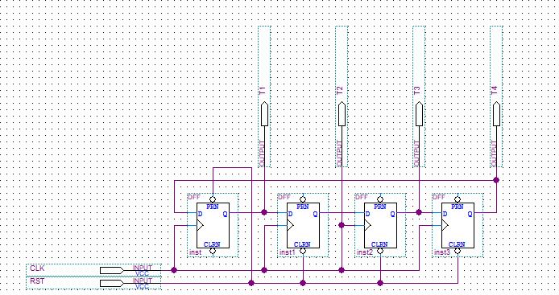
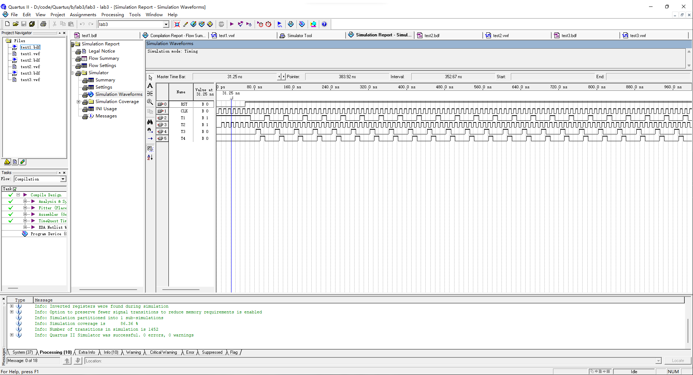
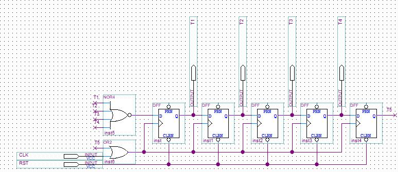
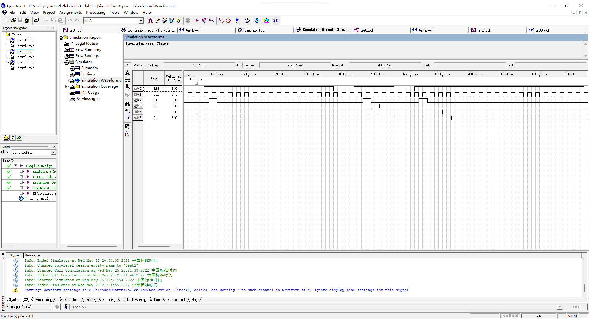
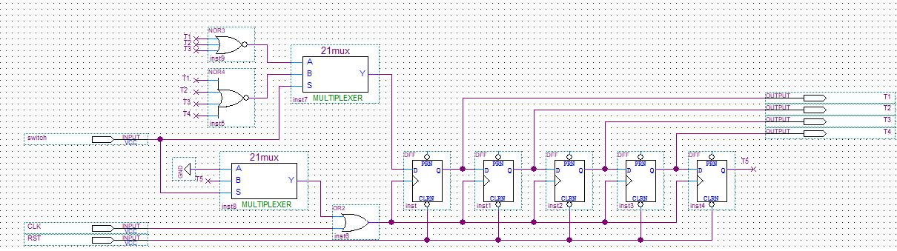
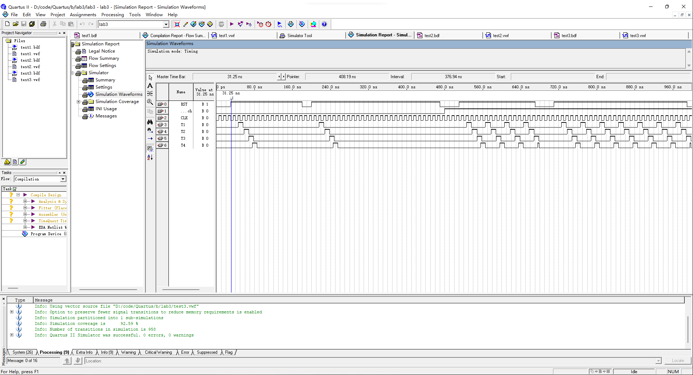

## 1. 实验目的

1. 掌握节拍脉冲发生器的设计方法和工作原理。
2. 理解节拍脉冲发生器的工作原理。

## 2. 实验环境

Quartus II 9.0

## 3. 实验原理及基本步骤

- 实验原理

  D 触发器是一种最简单的触发器，在触发边沿到来时，将输入端的值存入其中。在两个有效的脉冲边沿之间，D 的跳转不会影响触发器存储的值。

  1. 连续节拍发生电路由四个 D 触发器组成，由相同的 CLK 脉冲作为时钟信号。RST 为低电平时，T1 输出为 1，其余输出为 0；RST 为高电平时，四个 D 触发器将在时钟脉冲的控制下轮流输出 1。
  2. 单步节拍发生电路由连续节拍发生电路改进而来，通过 T5 的输出控制时钟信号，从而实现每当 RST 由 0 置 1 时只输出一组 T1, T2, T3, T4 信号。
  3. 通过增加两个2-1多路选择器，可将上述两电路合并为单步/连续节拍发生电路。S = 0 时，为单步运行；S = 1 时，为连续运行。

- 实验步骤

  1. 设计连续节拍发生电路，并进行波形仿真。
  2. 设计单步节拍发生电路，并进行波形仿真。
  3. 设计单步/连续节拍发生电路，并进行波形仿真。

## 4. 实验数据记录

1. 连续节拍发生器的原理图及波形仿真

   

   

2. 单步节拍发生器的原理图及波形仿真

   

   

3. 单步/连续节拍发生器的原理图及波形仿真

   

   

## 5. 实验结果分析

波形仿真结果与理论结果一致