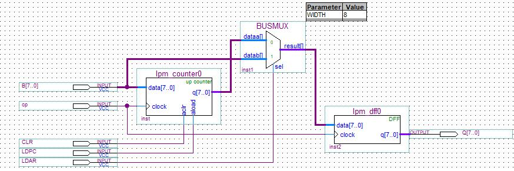
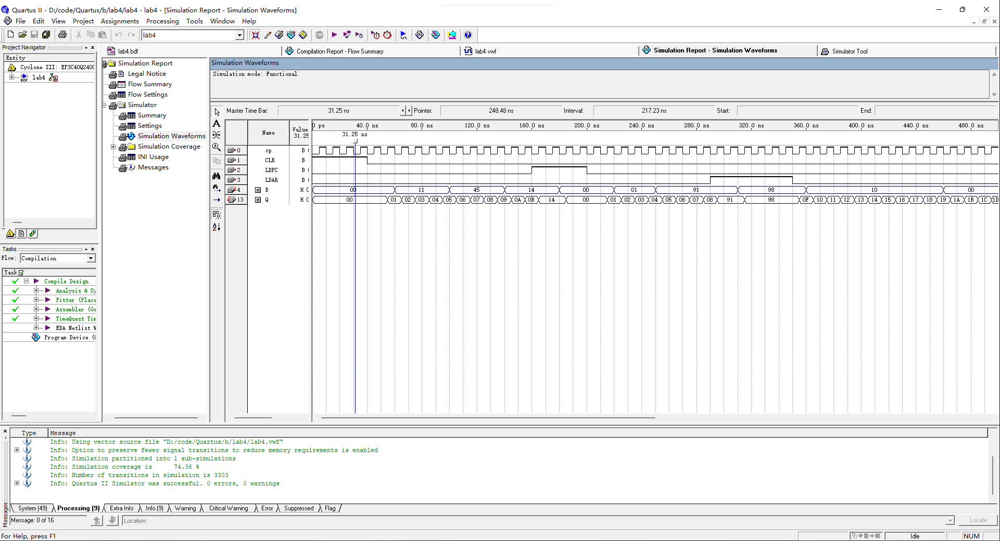

## 1. 实验目的

1. 掌握地址单元的工作原理。
1. 掌握的两种工作方式，加 1 计数和重装计数器初值的实现方法。
1. 掌握地址寄存器从程序计数器获得数据和从内部总线获得数据的实现方法。

## 2. 实验环境

Quartus II 9.0

## 3. 实验原理及基本步骤

- 实验原理

  1. 程序计数器 PC (lpm_counter) 存放下一条指令的地址。由于程序中的指令大多为顺序执行，所以 PC 有自增功能，在时钟信号脉冲下自动加 1。当 aclr 端口输入有效时，计数器清零，从零开始计数；当 aload 端口输入有效时，计数器读取 data 端数据，并从 data 开始计数。计数结果在时钟脉冲信号下从q端口输出。
  2. 地址寄存器 AR (lpm_dff) 用于存储 PC 的输出或来自内部数据总线的数据。
  3. 通过总线多路开关 BUSMUX 来实现两路输入数据的切换。当 LDAR 为低电平时，选择 PC 的输出；当 LDAR 为高电平时，选择内部数据总线的数据。
- 实验步骤

  1. 设计原理图。
  1. 对设计的原理图进行波形仿真。

## 4. 实验数据记录

1. 原理设计图

   

2. 波形仿真

   

## 5. 实验结果分析

波形仿真结果与理论结果一致