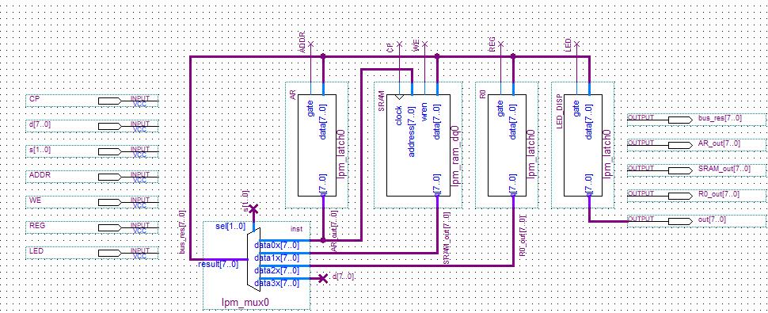
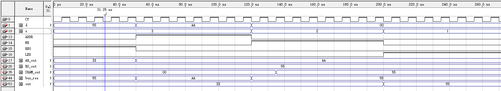

## 1. 实验目的

1. 理解总线的概念及特性。
1. 掌握总线传输控制特性。

## 2. 实验环境

Quartus II 9.0

## 3. 实验原理及基本步骤

- 实验原理

  地址寄存器 AR，存储器 SRAM，寄存器 R0，输出 LED 四个设备挂在总线上，采用总线输出多路开关结构加以控制，按照传输要求恰当有序地控制它们，就可以实现总线信息传输。
  
- 实验步骤

  1. 设计原理图。
  1. 对设计的原理图进行波形仿真。

## 4. 实验数据记录

1. 原理设计图

   

2. 波形仿真

   

## 5. 实验结果分析

理论分析：

1. s = 3，REG 高电平时，总线将 d 处数据 55H 输入 R0 中；
2. s = 3，ADDR 高电平时，总线将 d 处数据 AAH 输入 AR 中；
3. s = 2，WE 高电平时，SRAM 将 55H 写入 AAH 地址处；
4. s = 1，LED 高电平时，总线将 SRAM 中地址为 AAH 的数据输出到总线，通过 LED 输出。

经检验，仿真结果与理论结果一致。

