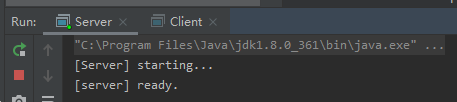
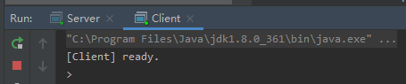
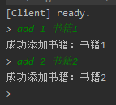
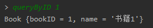
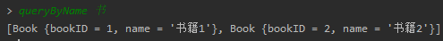
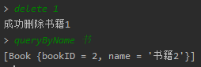
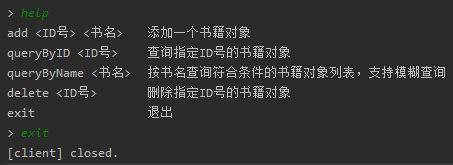

# 设计报告

#### 环境

``` powershell
Apache Maven 3.5.4 (1edded0938998edf8bf061f1ceb3cfdeccf443fe; 2018-06-18T02:33:14+08:00)
java version "1.8.0_361"
```

#### 结构

- org.example
  - client 包
    - Client.java 客户端
  - server 包
    - DataBase.java 数据库相关参数的接口
    - LibControllerImpl.java 接口实现类，实现对数据库的增删改查
    - Server.java 服务端
  - Book.java 类
  - LibController.java 通用接口

#### 运行

1. 构建

   ``` powershell
   mvn clear
   mvn compile
   ```

2. 进入target/classes目录下启动服务端

    ``` powershell
    cd target/classes
    java org.example.server.Server
    ```

	

3. 启动客户端

   ``` powershell
   java org.example.client.Client
   ```

   

4. 添加书籍

   

5. 按编号查找书籍

   

6. 按书名查找书籍

   

7. 按编号删除书籍

   

8. 其他功能

   