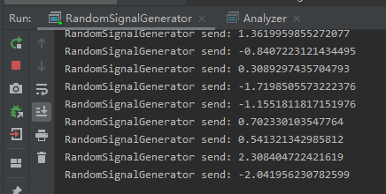
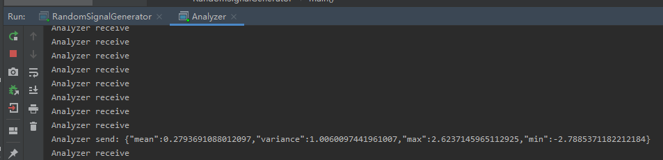
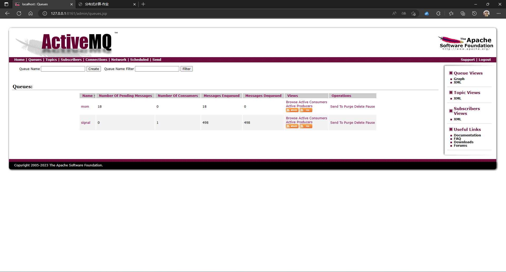
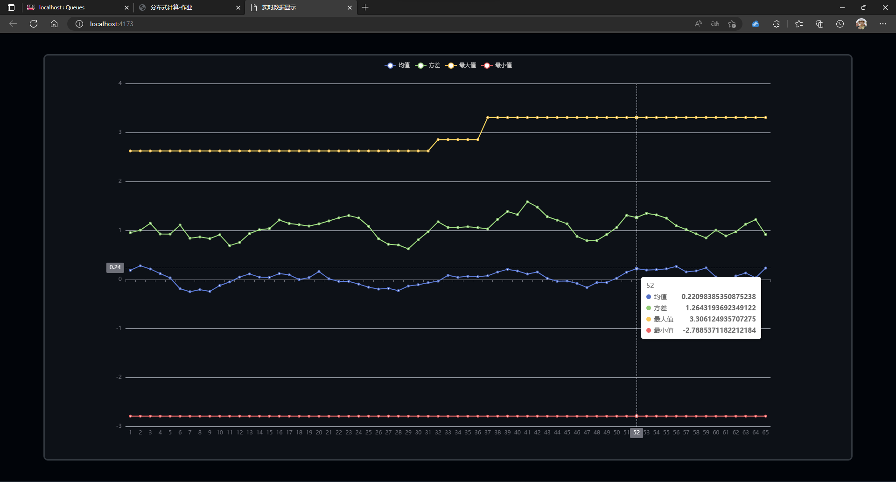

# 设计报告

## 环境

- Java

    ``` powershell
    java version "11.0.18" 2023-01-17 LTS
    Java(TM) SE Runtime Environment 18.9 (build 11.0.18+9-LTS-195)
    Java HotSpot(TM) 64-Bit Server VM 18.9 (build 11.0.18+9-LTS-195, mixed mode)
    ```

- Maven 3.5.4
- ActiveMQ 5.18.1 (Apr 14th, 2023)
- Node v18.13.0

## 项目结构

| 路径                                      | 备注                 |
| ----------------------------------------- | -------------------- |
| /                                         | 项目根目录           |
| /src/main/java/Producer.java              | 消息队列生产者       |
| /src/main/java/Consumer.java              | 消息队列消费者       |
| /src/main/java/RandomSignalGenerator.java | 随机信号产生器节点   |
| /src/main/java/Analyzer.java              | 随机信号统计分析节点 |
| /data-visualizer                          | 实时数据显示节点     |

## 运行

1. **编译 Java 项目**

   在根目录下

   ``` powershell
   mvn clean
   mvn complie
   ```

2. **编译 Vue 项目**

   在 `./data-visualizer` 目录下

   ``` powershell
   npm install
   npm run build
   ```

3. **启动消息队列**

   在 `ActiveMQ/bin` 目录下

   ``` powershell
   .\activemq start
   ```

   默认账号和密码为 `admin`

4. **启动随机信号产生器节点**

   在根目录下

   ```powershell
   mvn exec:java -D exec.mainClass="RandomSignalGenerator"
   ```

   

5. **启动随机信号统计分析节点**

   在根目录下新开一个终端

   ``` powershell
   mvn exec:java -D exec.mainClass="Analyzer"
   ```

   

6. 节点启动后可在 ActiveMQ 看到数据面板

   

7. **实时数据显示节点**

   在 `./data-visualizer` 目录下

   ``` powershell
   npm run preview
   ```

   