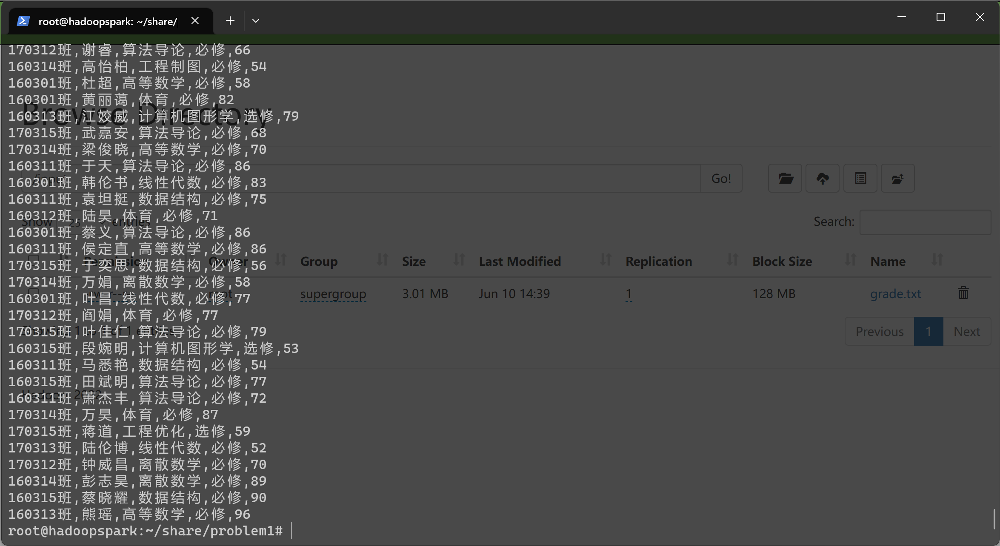
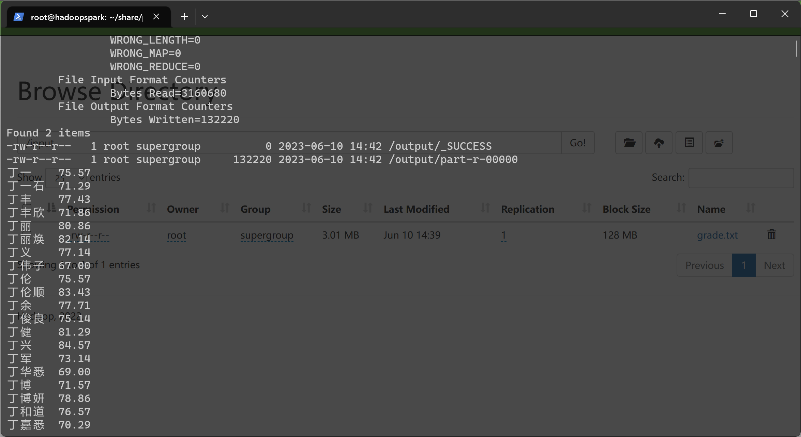
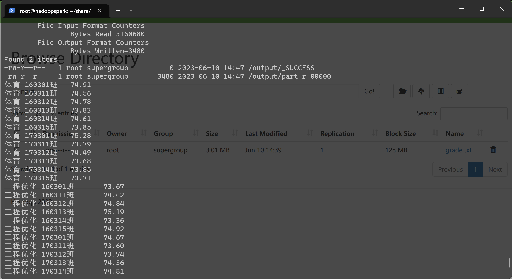
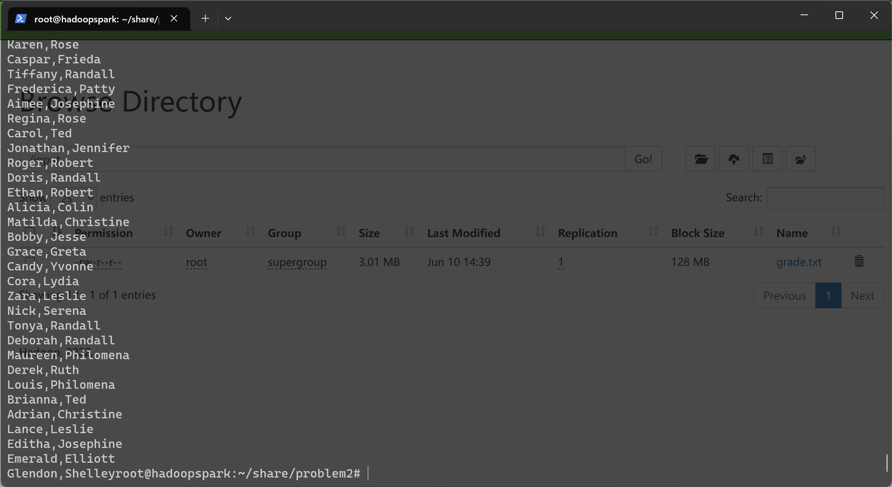
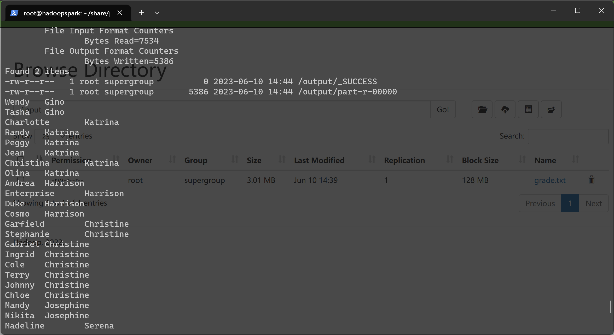

# README

## 题目要求

1. 题目一

   输入文件为学生成绩信息，包含了必修课与选修课成绩。

   编写两个 Hadoop 平台上的 MapReduce 程序，分别实现如下功能：

   1. 计算每个学生必修课的平均成绩。
   2. 按科目统计每个班的平均成绩。

2. 题目二

   输入文件的每一行为具有父子/父女/母子/母女/关系的一对人名。

   编写 Hadoop 平台上的 MapReduce 程序，找出所有具有 grandchild - grandparent 关系的人名组。

## 开发环境与系统环境

- Windows11 22H2
- WSL 版本: 1.2.5.0
- Docker version 20.10.22
- Java 8
- IDEA 2019.3

## 具体设计

### 工程结构

- 题目一

    ``` powershell
    problem1
    │  grade.txt # 实验测试数据
    │  pom.xml
    │  run1.sh # 求解1小问的脚本
    │  run2.sh # 求解2小问的脚本
    │  upload.sh # 将实验测试数据上传到HDFS的脚本
    │
    └─src
       └─main
           └─java
                   MR1.java # 求解1小问的java程序
                   MR2.java # 求解2小问的java程序
    ```

- 题目二

  ```powershell
  problem2
  │  child-parent.txt # 实验测试数据
  │  pom.xml
  │  run.sh # 求解脚本
  │  upload.sh # 将实验测试数据上传到HDFS的脚本
  │
  └─src
     └─main
         └─java
                 MR.java # 求解的java程序
  ```

### 设计思想

- 题目一

  - 1小问

      Map 阶段：读取每条记录按 `,` 分割，挑出必修科目，构建学生姓名和成绩的键值对

      ``` java
      String line = value.toString();
      String[] split = line.split(",");
      // 过滤必修
      if (split[3].equals("必修")) {
          String name = split[1];
          String grade = split[4];
          context.write(new Text(name), new Text(grade));
          // 输出格式为 <name: grade>
      }
      ```

      Reduce 阶段：键值对按照键值聚合，对一个学生对应的所有成绩求平均值，保留两位小数

      ``` java
      double sum = 0.0;
      int len = 0;
      for (Text grade : grades) {
          sum += Double.parseDouble(grade.toString());
          len++;
      }
      double avg = sum / len;
      String avgString = String.format("%.2f", avg);
      context.write(key, new Text(avgString));
      ```
      
  - 2小问

      Map 阶段：将课程名和班级名拼接作为键，成绩作为值，构建键值对

      ``` java
      String line = value.toString();
      String[] split = line.split(",");
      String className = split[0];
      String subjectName = split[2];
      String grade = split[4];
      // 拼接课程名和班级名
      context.write(new Text(subjectName+" "+className), new Text(grade));
      // 输出格式为 <"subject class": grade>
      ```

      Reduce 阶段同上

- 题目二

  Map 阶段：对于每条记录产生两个键值对。一个键值对表示子父关系，子为键，父为值，并且在父后打上标签 `1`；另一个键值对表示父子关系，父为键，子为值，并在子后打上标签 `0`

  ``` java
  String line = value.toString();
  String[] splitLine = line.split(",");
  String child = splitLine[0];
  String parent = splitLine[1];
  context.write(new Text(child), new Text(parent + "-1"));
  context.write(new Text(parent), new Text(child + "-0"));
  // <one: parent-1> <one: child-0>
  ```
  

Reduce 阶段：键值对按照键值聚合，将值分为两个数组：`grandparents` 和 `grandchildren`。两个数组中两两配对可以得到对应的爷孙关系

  ``` java
  // <one: parent-1, child-0, parent-1, child-0>
  List<String> grandparents = new ArrayList<>();
  List<String> grandchildren = new ArrayList<>();
  for (Text v : values) {
      String[] tmp = v.toString().split("-");
      if (tmp[1].equals("0")) {
          grandchildren.add(tmp[0]);
      } else if (tmp[1].equals("1")) {
          grandparents.add(tmp[0]);
      }
  }
  for (String grandchild : grandchildren) {
      for (String grandparent : grandparents) {
          context.write(new Text(grandchild), new Text(grandparent));
      }
  }
  ```

## 实验结果

1. 题目一

   上传数据

   

   1小问结果输出

   

   2小问结果输出

   

2. 问题2

   上传数据

   

   结果输出

   

## 实验问题

1. WSL2 占位程序接收到错误数据。 Error code: Wsl/Service/0x800706f7

   在管理员权限下进入 powershell，运行 `netsh winsock reset`

2. 启动 docker 容器时显示端口占用

   由于 hyper-v 会保留部分 tcp 端口，使用命令可以看到:

   ```
   netsh interface ipv4 show excludedportrange protocol=tcp
   ```

   管理员下运行命令 `net stop winnat` ，暂时关闭

   实验结束后运行 `net start winnat` ，重新打开