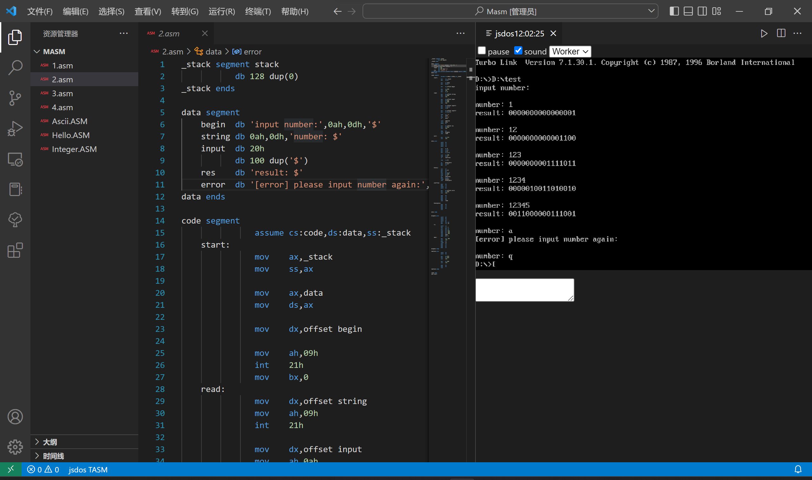

# 微机系统实验


## 实验一 汇编语言编程实验

1. **实验目的**

    1. 掌握汇编语言的编程方法

    2. 掌握DOS功能调用的使用方法

    3. 掌握汇编语言程序的调试运行过程

2. **实验内容**
   
    1. 将指定数据区的字符串数据以ASCII码形式显示在屏幕上，并通过DOS功能调用完成必要提示信息的显示。
    2. 在屏幕上显示自己的学号姓名信息。
    3. 循环从键盘读入字符并回显在屏幕上，然后显示出对应字符的ASCII码，直到输入”Q”或“q”时结束。
    4. 自主设计输入显示信息，完成编程与调试，演示实验结果。
    
3. **实验步骤**
    1. 运行QTHPCI软件，根据实验内容，参考程序流程图编写程序。
    2. 选择“项目”菜单中的“编译”或“编译连接”对实验程序进行编译连接。
    3. 选择“调试”菜单中的“进行调试”，进入Debug调试，观察调试过程中传输指令执行后各寄存器及数据区的内容。按F9连续运行。
    
4. **代码**

    ```assembly
    mystack segment stack
    	        db 256 dup(?)
    mystack ends
    
    data segment
    	hello  db  'Hello world!$'
    	lhello equ $ - hello
    	endl   db  0dh, 0ah, '$'
    	no     db  'Number: 20009200998$'
    	nm     db  'Name: Wang Junjian$'
    	info   db  'Input chars: (q or Q to quit)$'
    	tip    db  '>>> $'
    	char   db  '[char]: $'
    	ascii  db  '[ASCII]: $'
    	endd   db  'program ends.$'
    data ends
    
    code segment
    	       assume cs:code, ds:data
    	start: 
    	       mov    ax, data
    	       mov    ds, ax
    
    	; task1
    
    	       mov    dx, offset hello
    	       mov    ah, 9           	; display str
    	       int    21h
    	       mov    dx, offset endl 	; \n
    	       mov    ah, 9
    	       int    21h
    	       mov    dx, offset ascii
    	       mov    ah, 9
    	       int    21h
    
    	; convert hello into ascii
    	       mov    cx, lhello
    	       lea    si, hello       	; si point to hello
    	cnvt0: 
    	       mov    bl, [si]        	; low 4
    	       mov    bh, [si]        	; high 4
    	       inc    si
    	       push   cx
    
    	; high 4
    	       and    bh, 0f0h
    	       mov    cl, 4
    	       shr    bh, cl
    	       cmp    bh, 9           	; if bh > 9(1001) then the output is characters nut nums!
    	       jbe    no1
    	       add    bh, 7h          	; h4 > 9
    	no1:                          	; h4 <= 9
    	       add    bh, '0'
    	; disp in ascii
    	       mov    dl, bh
    	       mov    ah, 2
    	       int    21h
    	
    	; low 4
    	       and    bl, 0fh
    	       cmp    bl, 9
    	       jbe    no2
    	       add    bl, 7h          	; l4 > 9
    	no2:                          	; l4 <= 9
    	       add    bl, '0'
    	; disp in ascii
    	       mov    dl, bl
    	       mov    ah, 2
    	       int    21h
    	
    	; end of one turn
    	       mov    dl, 32          	; (space)
    	       mov    ah, 2
    	       int    21h
    	       pop    cx
    	       loop   cnvt0
    
    	; end of task1
    	       mov    dx, offset endl
    	       mov    ah, 9
    	       int    21h
    
    	; task2
    
    	       mov    dx, offset no
    	       mov    ah, 9
    	       int    21h
    	       mov    dl, 9
    	       mov    ah, 2
    	       int    21h
    	       mov    dx, offset nm
    	       mov    ah, 9
    	       int    21h
    	       mov    dx, offset endl
    	       mov    ah, 9
    	       int    21h
    
    	; task3
    
    	       mov    dx, offset info
    	       mov    ah, 9
    	       int    21h
    	       mov    dx, offset endl
    	       mov    ah, 9
    	       int    21h
    	cnvt:  
    	       mov    dx, offset tip
    	       mov    ah, 9
    	       int    21h
    	       mov    ah, 1           	; input into al and disp
    	       int    21h
    		
    	; q or Q to quit
    	       cmp    al, 'q'
    	       je     ending
    	       cmp    al, 'Q'
    	       je     ending
    	
    	; store to bh/bl
    	       mov    bl, al          	; low 4
    	       mov    bh, al          	; high 4
    	
    	       mov    dx, offset endl
    	       mov    ah, 9
    	       int    21h
    	
    	; disp [char]: x\t[ASCII]:
    	       mov    dx, offset char
    	       mov    ah, 9
    	       int    21h
    	       mov    dl, bl
    	       mov    ah, 2
    	       int    21h
    	       mov    dl, 9
    	       mov    ah, 2
    	       int    21h
    	       mov    dx, offset ascii
    	       mov    ah, 9
    	       int    21h
    	
    	; high 4
    	       and    bh, 0f0h
    	       mov    cl, 4
    	       shr    bh, cl
    	       cmp    bh, 9
    	       jbe    noh
    	       add    bh, 7h
    	noh:   
    	       add    bh, '0'
    	       mov    dl, bh
    	       mov    ah, 2
    	       int    21h
    	
    	; low 4
    	       and    bl, 0fh
    	       cmp    bl, 9
    	       jbe    nol
    	       add    bl, 7h
    	nol:   
    	       add    bl, '0'
    	       mov    dl, bl
    	       mov    ah, 2
    	       int    21h
    	
    	;end of one turn
    	       mov    dx, offset endl
    	       mov    ah, 9
    	       int    21h
    	       jmp    cnvt
    
    	; END
    	
    	ending:
    	       mov    dx, offset endl
    	       mov    ah, 9
    	       int    21h
    	       mov    dx, offset endd
    	       mov    ah, 9
    	       int    21h
    	       mov    ah, 4ch
    	       int    21h
    
    code ends
    end start
    
    ```
    
5. **实验结果**

    


## 实验二 数码转换实验

1. **实验目的**

    1. 掌握不同进制数及编码相互转换的程序设计方法。
    2. 掌握运算类指令编程及调试方法。
    3. 掌握循环程序的设计方法。

2. **实验内容**

    1. 重复从键盘输入不超过5位的十进制数，按回车键结束输入；
    2. 将该十进制数转换成二进制数；结果以2进制数的形式显示在屏幕上；
    3. 如果输入非数字字符，则报告出错信息，重新输入；
    4. 直到输入“Q”或‘q’时程序运行结束。
    5. 键盘输入一字符串，以空格结束，统计其中数字字符的个数，在屏幕显示

3. **实验原理**

    十进制数可以表示为：$D_n*10^n+D_{n-1}*10^{n-1}+…+D_0*10^0=\sum{D_i*10^i}$

    其中Di代表十进制数1、2、3、…、9、0。

    上式可以转换为：$\sum{D_i*10^i}=(((D_n*10+D_{n-1})*10+D_{n-2})*10+...+D_1)*10+D_0$

    由上式可归纳出十进制数转换为二进制数的方法：从十进制数的最高位$D_0$开始做乘10加次位的操作，依此类推，则可求出二进制数结果。

4. **代码**

    ``` assembly
    _stack segment stack
    	       db 128 dup(0)
    _stack ends
    
    data segment
    	begin  db 'input number:',0ah,0dh,'$'
    	string db 0ah,0dh,'number: $'
    	input  db 20h
    	       db 100 dup('$')
    	res    db 'result: $'
    	error  db '[error] please input number again:',0ah,0dh,'$'
    data ends
    
    code segment
    	           assume cs:code,ds:data,ss:_stack
    	start:     
    	           mov    ax,_stack
    	           mov    ss,ax
    
    	           mov    ax,data
    	           mov    ds,ax
     
    	           mov    dx,offset begin
     
    	           mov    ah,09h
    	           int    21h
    	           mov    bx,0
    	read:      
    	           mov    dx,offset string
    	           mov    ah,09h
    	           int    21h
    
    	           mov    dx,offset input
    	           mov    ah,0ah
    	           mov    al,00h
    	           int    21h
    
    	           mov    bx,offset input+1
    	           mov    cx,[bx]
    	           mov    ch,0
    
    	           mov    dx,offset input+2
    	           mov    al,[bx+1]
    
    	           cmp    al,'q'
    	           je     exit
    	           cmp    al,'q'
    	           je     exit
     
    	           call   newline
    	           call   atoi
    	           push   ax
    
    	           mov    dx,offset res
    	           mov    ah,09h
    	           int    21h
    
    	           pop    ax
    	           call   dispbin
    	           jmp    read
     
    	exit:      
    	           mov    ah,4ch
    	           int    21h
    
    atoi proc
    	           push   bx
    	           push   si
    	           push   cx
    	           push   dx
    		
    	           mov    bx,0
    	           mov    si,dx
    	           mov    ah,0
    	           mov    al,[si]
     
    	           sub    ax,30h
    	           cmp    ax,9
    	           ja     overflow
    
    	           cmp    cx,1h
    		
    	           je     binaryproc
    	           mov    dx,10
    	           dec    cx
    
    	binary:    
    	           inc    si
    	           mov    dx,10
    	           mul    dx
    	           mov    bl,[si]
    	           sub    bl,30h
    	           cmp    bl,9
    	           ja     overflow
    	           add    ax,bx
    	           loop   binary
    	           jmp    binaryproc
    
    	overflow:  
    	           pop    dx
    	           pop    cx
    	           push   cx
    	           push   dx
    
    	           mov    dx,offset error
    	           mov    ah,09h
    	           int    21h
    
    	           pop    dx
    	           pop    cx
    	           pop    si
    	           pop    bx
    	           jmp    read
    
    	binaryproc:
    	           pop    dx
    	           pop    cx
    	           pop    si
    	           pop    bx
    	           ret
     
    atoi endp
    
    	
    dispbin proc
    	           push   ax
    	           push   bx
    	           push   cx
    	           push   dx
    	           mov    bx, ax
    	           mov    cx, 16
    	l1:        
    	           push   cx
    	           mov    cl, 1
    	           rol    bx, cl
    	           mov    dl, bl
    	           and    dl, 01h
    	           add    dl, 30h
    	           cmp    dl, 39h
    	           jbe    deal
    	           add    dl, 7
    	deal:      
    	           mov    ah, 02h
    	           int    21h
    	           pop    cx
    	           loop   l1
    	           pop    dx
    	           pop    cx
    	           pop    bx
    	           pop    ax
    dispbin endp
    	
    newline proc
    	           push   ax
    	           push   dx
     
    	           mov    ah,02h
    	           mov    dl,0ah
    	           int    21h
    
    	           mov    dl,0dh
    	           int    21h
    
    	           pop    dx
    	           pop    ax
    	           ret
    newline endp
    
    
    code ends
    end start
    ```

5. **实验结果**

    


## 实验三 基本IO口扩展实验

1. **实验目的**

    1. 了解TTL芯片扩展简单I/O口的方法。
    2. 掌握数据输入输出程序编制的方法。

2. **实验内容说明**

    本实验要求用**74LS244**作为输入口，读取开关状态，并将此状态通过**74LS273**连到发光二极管显示。具体实验内容如下：

    1. 开关Yi为低电平时对应的发光二极管亮，Yi为高电平时对应的发光二极管灭。
    2. 当开关Yi全为高电平时，发光二极管Qi从左至右轮流点亮。
    3. 当开关Yi全为低电平时，发光二极管Qi从右至左轮流点亮。
    4. 自主设计控制及显示模式，完成编程调试，演示实验结果。

3. 实验原理

    **74LS244**是一种三态输出的8总线缓冲驱动器，无锁存功能，当G为低电平，Ai信号传送到Yi，当为高电平时，Yi处于禁止高阻状态；

    **74LS273**是一种带清除功能的8D触发器， 1D～8D为数据输入端，1Q～8Q为数据输出端，正脉冲触发，低电平清除，常用作8位地址锁存器。

4. **实验步骤**

    1. 按照实验连线图连接：
        1. **244**的CS接到ISA总线接口模块的0000H，Y7—Y0——开关K1—K8。
        2. **273**的CS接到ISA总线接口模块的0020H，Q7—Q0——发光二极管L1—L8。
        3. 该模块的WR、RD分别连到ISA总线接口模块的IOWR、IORD。
        4. 该模块的数据（AD0～AD7）连到ISA总线接口模块的数据（LD0～LD7）。
    2. 编写实验程序，编译链接，运行程序
    3. 拨动开关，观察发光二极管的变化。

5. **代码**

    ```assembly
    io244	equ	0230h	;74ls244 addr
    io273	equ	0230h	;74ls273 addr
    
    mystack segment	stack
    	        dw 100	dup(?)
    mystack ends
    
    data segment word	 public 'data'
    data ends
    
    code segment
    	       assume cs:code, ds:data, ss:mystack
    
    start proc	 near
    	       mov    ax, data
    	       mov    ds, ax
    	input: 
    	       mov    dx, io244
    	       in     ax, dx
    	       cmp    ax, 0ffffh                  	; switch all low (1111 1111 1111 1111)
    	       jz     q1                          	; light <<
    	       cmp    ax, 0                       	; all high (0000 0000 0000 0000)
    	       jz     q2                          	; light >>
    	       mov    dx, io273
    	       and    ax, 00ffh
    	       out    dx, ax
    	       jmp    input
    	q1:    
    	       mov    ax, 7fffh
    	       mov    dx, io273
    	r2l:   
    	       call   delay
    	       out    dx, ax
    	       rol    ax, 1
    	       cmp    ax, 7fffh
    	       jne    r2l                         	; equal -> finish one turn
    	       jmp    input
    		
    	q2:    
    	       mov    ax, 0fffeh
    	       mov    dx, io273
    	l2r:   
    	       call   delay
    	       out    dx, ax
    	       ror    ax, 1
    	       cmp    ax, 0fffeh
    	       jne    l2r                         	; equal -> finish one turn
    	       jmp    input                       	; read switch
    
    delay proc near
    	delay1:
    	       xor    cx,cx                       	; clear
    	       loop   $
    	       ret
    
    delay endp
    start endp
    code ends
    end		start
    
    ```


## 实验四 可编程并行接口实验

1. **实验目的**

    1. 了解可编程并行接口8255的内部结构。
    2. 掌握工作方式、初始化编程及应用。

2. **实验内容**

    1. 流水灯实验：利用**8255**的A口、B口循环点亮发光二极管。
    2. 交通灯实验：利用**8255**的A口模拟交通信号灯。
    3. I/O输入输出实验：利用**8255**的A口读取开关状态，**8255**的B口把状态送发光二极管显示。
    4. 在完成1. 基础上，增加通过读取开关控制流水灯的循环方向和循环方式。
    5. 在完成2. 基础上，增加通过读取开关控制交通红绿灯的亮灭时间。

3. **实验原理**

    **8255**是一个通用可编程并行接口电路。它具有A、B、C三个8位并行口。其中C口也可用作A、B口的联络信号及中断申请信号。通过编程，它可以被设置为基本输入输出、选通输入输出以及双向传送方式。对于C口还具有按位置0、1的功能。

4. **实验步骤**

    1. **流水灯实验**

        模块的WR、RD分别连到ISA总线接口模块的IOWR、IORD。

        模块的数据（AD0～AD7）、地址线（A0～A7）分别连到ISA总线接口模块的数据（LD0～LD7）、地址线（LA0～LA7）。

        **8255**模块选通线CE连到ISA总线接口模块的0000H。

        **8255**的PA0～PA7连到发光二极管的L0～L7；**8255**的PB0～PB7连到发光二极管的L8～L15。

        运行程序，观察发光二极管。

    2. **交通灯实验**

        模块的WR、RD分别连到ISA总线接口模块的IOWR、IORD。

        模块的数据（AD0～AD7）、地址线（A0～A7）分别连到ISA总线接口模块的数据（LD0～LD7）、地址线（LA0～LA7）。

        **8255**模块选通线CE连到ISA总线接口模块的0000H。

        **8255**的PA0-L7、PA1-L6、PA2-L5、PA3-L3、PA4-L2、PA5-L1。

        运行程序，观察发光二极管。

    3. **I/O输入输出实验**

        该模块的WR、RD分别连到ISA总线接口模块的IOWR、IORD。

        该模块的数据（AD0～AD7）、地址线（A0～A7）分别连到ISA总线接口模块的数据（LD0～LD7）、地址线（LA0～LA7）。

        **8255**模块选通线CE连到ISA总线接口模块的0000H。

        **8255**的PA0～PA7接开关K0～K7，8255的PB0～PB7接发光二极管L0～L7。

        运行程序，拨动开关,观察发光二极管。
    
5. **代码** 交通灯实验

    ``` assembly
    COM_ADD		EQU	0273H	
    PA_ADD		EQU	0270H	
    PB_ADD		EQU	0271H	
    PC_ADD		EQU	0272H	
    
    _stack segment	stack
    	       dw 100 dup(?)
    _stack ends
    			
    _data segment	word public 'data'
    	led_data db 10111110b	;东西绿灯，南北红灯
    	         db 10111111b	;东西绿灯闪烁，南北红灯
    	         db 10111101b	;东西黄灯亮，南北红灯
    	         db 11101011b	;东西红灯，南北绿灯
    	         db 11111011b	;东西红灯，南北绿灯闪烁
    	         db 11011011b	;东西红灯，南北黄灯亮
    _data ends
    			
    code segment
    start proc	near
    	         assume cs:code, ds:_data, ss:_stack
    	         mov    ax,_data
    	         mov    ds,ax
    	         nop
    	         mov    dx,COM_ADD
    	         mov    al,80h                      	;pa、pb、pc为基本输出模式
    	         out    dx,al
    	         mov    dx,PA_ADD                   	;灯全熄灭
    	         mov    al,0ffh
    	         out    dx,al
    	         lea    bx,led_data
    	start1:  mov    al,0
    	         xlat
    	         out    dx,al                       	;东西绿灯，南北红灯
    	         call   dl5s
    	         mov    cx,6
    	start2:  mov    al,1
    	         xlat
    	         out    dx,al                       	;东西绿灯闪烁，南北红灯
    	         call   dl500ms
    	         mov    al,0
    	         xlat
    	         out    dx,al
    	         call   dl500ms
    	         loop   start2
    	         mov    al,2                        	;东西黄灯亮，南北红灯
    	         xlat
    	         out    dx,al
    	         call   dl3s
    	         mov    al,3                        	;东西红灯，南北绿灯
    	         xlat
    	         out    dx,al
    	         call   dl5s
    	         mov    cx,6
    	start3:  mov    al,4                        	;东西红灯，南北绿灯闪烁
    	         xlat
    	         out    dx,al
    	         call   dl500ms
    	         mov    al,3
    	         xlat
    	         out    dx,al
    	         call   dl500ms
    	         loop   start3
    	         mov    al,5                        	;东西红灯，南北黄灯亮
    	         xlat
    	         out    dx,al
    	         call   dl3s
    	         jmp    start1
    
    
    dl500ms proc	near
    	         push   cx
    	         mov    cx,60000
    	dl500ms1:loop   dl500ms1
    	         pop    cx
    	         ret
    dl500ms endp
    
    dl3s proc	near
    	         push   cx
    	         mov    cx,6
    	dl3s1:   call   dl500ms
    	         loop   dl3s1
    	         pop    cx
    	         ret
    	         endp
    			
    dl5s proc	near
    	         push   cx
    	         mov    cx,10
    	dl5s1:   call   dl500ms
    	         loop   dl5s1
    	         pop    cx
    	         ret
    	         endp
    
    start endp
    code ends
    	 	end	start
    
    ```

    