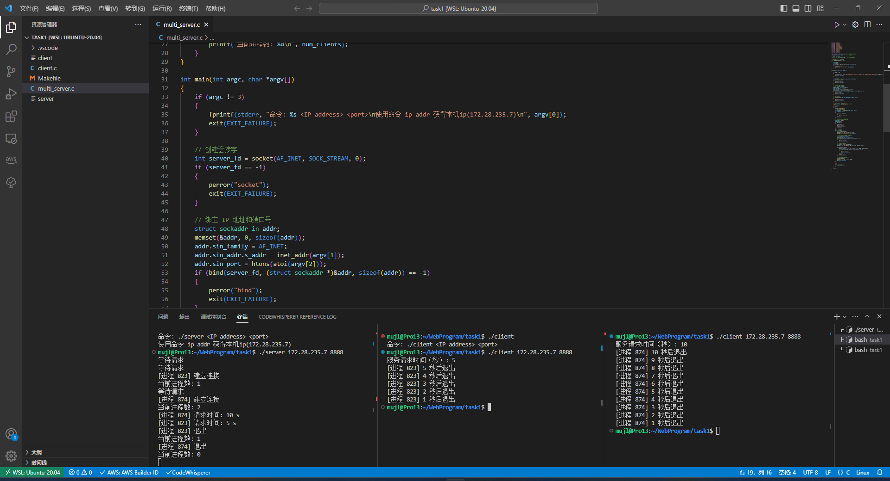

#  实验报告

#### 实验名称

linux 平台上的TCP并发服务

#### 实验目的：

掌握基本套接字函数使用方法、TCP协议工作原理、并发服务原理和编程方法。

#### 实验内容：

在linux平台上实现1个TCP并发服务器，至少可以为10个客户端同时提供服务。

1. 基于TCP套接字编写服务器端程序代码，然后编译和调试；
2. 服务器程序要达到：可以绑定从终端输入的IP地址和端口；可以显示每一个进程的进程号；可以显示当前并发执行的进程数量；可以根据客户机要求的服务时间确定进程的生存时间。
3. 基于TCP套接字编写客户端程序代码，然后编译和调试；
4. 客户端程序要达到：可以从终端输入服务器的IP地址和端口；可以从终端输入对服务器的服务时间要求。
5. 联调服务器和客户端，服务器每收到一个连接就新建一个子进程，在子进程中接收客户端的服务时间请求，根据所请求的时间进行延时，然后终止子进程。如：客户端请求服务10s，则服务器的子进程运行10s，然后结束。
6. 服务器要清除因并发服务而产生的僵尸进程。

#### 实验结果：

