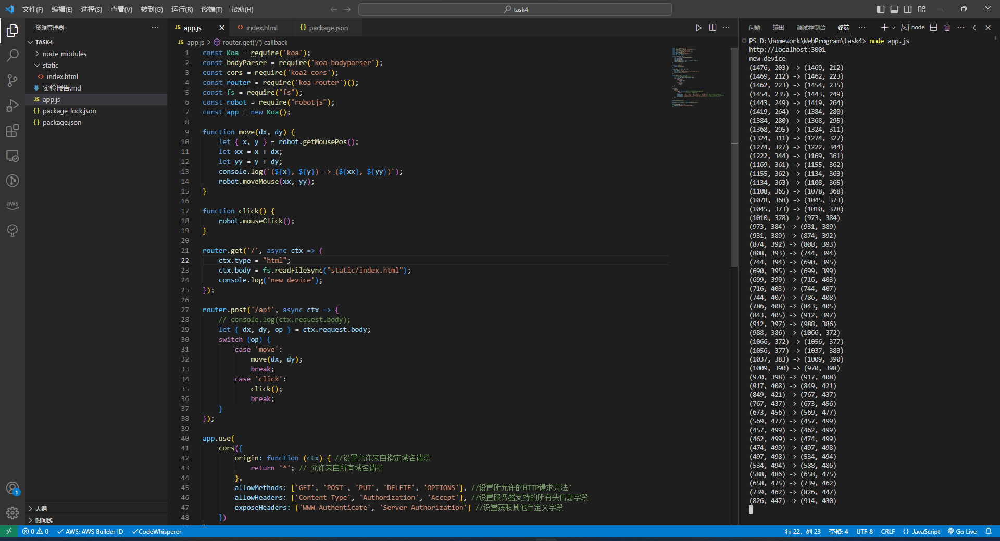
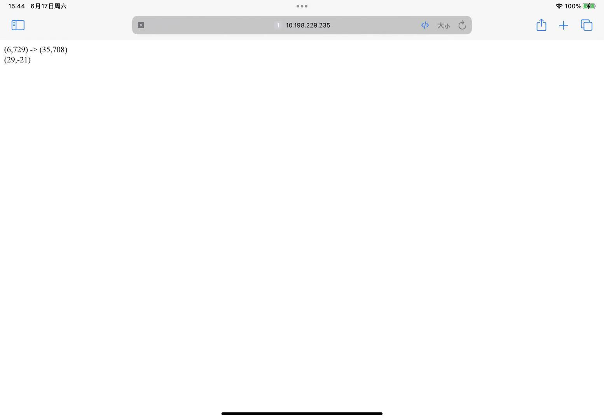

#  实验报告

#### 实验名称

用手机触屏控制PC机鼠标

#### 实验目的：

了解Android开发环境、Wifi技术特点，掌握Android环境下的网络程序设计基本方法。

#### 实验内容：

在Android手机上读取触屏数据，将人手在触屏上的滑动轨迹通过wifi网络发送到PC机上；PC机上安装鼠标控制程序，根据手机发来的数据，鼠标的光标作相应移动。

1. 在手机上编程，读取人手在触屏上的滑动信息；
2. 通过wifi网络，把滑动数据发送到PC机;
3. PC机根据wifi送达的数据控制鼠标光标移动；

#### 实验结果：

